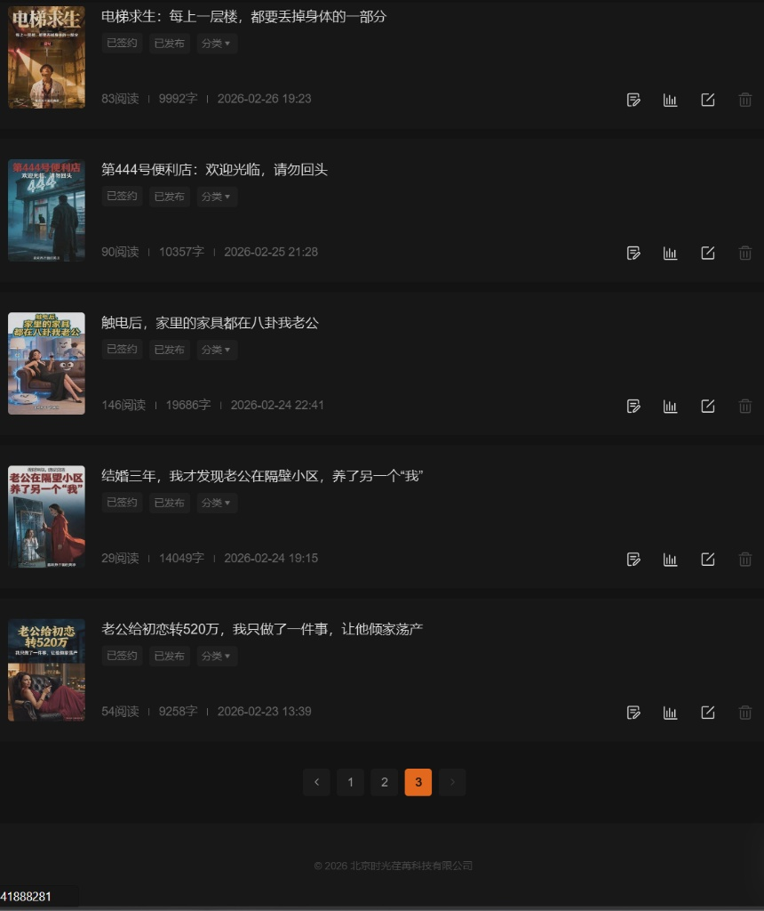
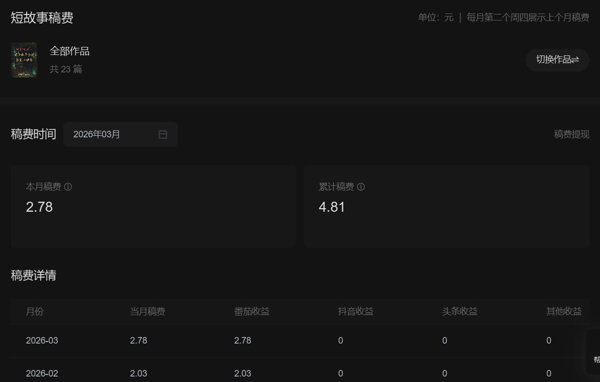

### 试水：当理工男开始写悬疑

作为一个常年和 MES 系统、数据库打交道的实施工程师，我的日常充满了严谨的逻辑和冰冷的数据。但谁说理科生不能有天马行空的想象力呢？

借助当下强大的 AI 工具作为辅助，我开始尝试将脑海中的那些灵光一现转化为文字。一开始，我主攻的是短篇悬疑和脑洞故事。

从《电梯求生》到《第444号便利店》，再到探讨婚姻与人性的《触电后，家里的家具都在八卦我老公》。在这个过程中，AI 像是一个不知疲倦的打字员和灵感碰撞机。我负责把控故事的骨架、反转的节点和人物的动机，而 AI 帮我迅速丰满血肉，极大地提高了产出效率。

### 数据反馈：小小的里程碑

把作品发布到平台后，看着后台的数据一点点跳动，那种感觉非常奇妙。这和看着一行 SQL 代码成功执行是完全不同的多巴胺分泌体验。

不知不觉中，这些短故事竟然也积累了将近 **7000 次的展现量和 600 多次的真实阅读**。虽然在网文大神眼里这连个零头都算不上，但对于一个初入网文圈的新手来说，每一个数字背后，都是一个素昧平生的读者在我的故事里停留过的痕迹。

### 变现：从0到1的商业闭环

当然，最让人兴奋的，还是真金白银的“稿费”入账。

看！累计稿费 **4.81 元**！
你可能觉得好笑，这点钱连买杯奶茶都不够，甚至可能只够共享单车骑两次。但在我看来，这几块钱的意义非凡。它证明了我的“人机协作”创作模式是可行的，证明了我的内容是有市场价值的。这是彻底跨越了从“自娱自乐”到“商业变现”的鸿沟。

### 进阶：向着更宏大的世界观进发

在短篇故事上尝到甜头、摸清了平台规则后，我开始不满足于此。我尝试着拉长篇幅，向着连载小说的方向进发。

《入职诡异公司，我把老板逼疯》、《全家偷听我吃瓜心声》……看着这些作品被打上“已签约”的标签，成就感油然而生。

**这仅仅是一个开始。**

这几个月的 AI 短篇和中篇的试水，其实都是我的练兵场。我正在打磨一套属于自己的、包含世界观构建、大纲拆解、人物小传和 AI 扩写的工作流。因为在我的文档深处，**一部 50 万字的长篇巨制小说正在紧锣密鼓地构思中。**

这几块钱的稿费，就是我建立宏大文字帝国的基石。键盘上的赛博造梦之旅，未完待续。