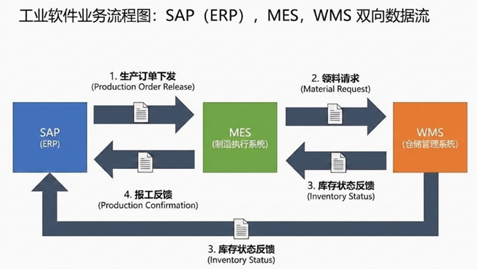
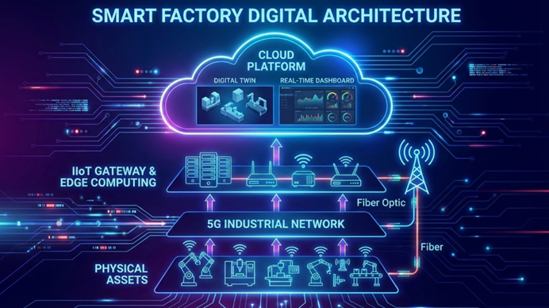

## 前言
本手册旨在定义企业从决策到执行的层级边界，并展示三大系统（ERP-MES-WMS）间的数据流转与业务协同，为工业软件实施提供标准化参考。

---

## 第一部分：纵向集成架构（金字塔模型）

核心逻辑遵循 **ISA-95 国际标准**，明确了企业各层级的职责划分。

*图1：基于 ISA-95 标准的企业垂直集成模型*

### 1. 架构说明
* **数据源头管理**：ERP 负责维护全局主数据（Master Data），确保编码与 BOM 的唯一性，避免 MES 或 WMS 出现数据孤岛。
* **通信协议标准**：L3 与 L4 层级间主要采用 OPC UA 或 MQTT 协议，实现跨平台设备实时通讯。这种非专有协议的应用，极大降低了系统集成的复杂度，支持跨品牌、跨平台的设备实时通讯。
* **双向反馈机制**：该架构支持指令下行（如 ERP 下发生产计划）与数据上行（如现场传感器数据实时回传至看板），实现了生产全流程的闭环管理。

### 2. 层级边界定义
* **ERP vs MES**：边界在于“工单”。ERP 决定“做什么、做多少”，MES 决定“怎么做、谁来做、现在做到了哪一步”。
* **MES vs SCADA**：边界在于“时间粒度”。MES 关注班组进度（分钟/小时），SCADA 关注实时数值（秒/毫秒）。
* **SCADA vs PLC**：边界在于“控制权”。PLC 是执行大脑，SCADA 是监控部。如果 SCADA 关了，PLC 依然能让机器运转；如果 PLC 坏了，机器就瘫痪了。

---

## 第二部分：横向业务闭环（ERP-MES-WMS 协同）

以生产订单为核心，展示三大系统间的业务协同与数据流。

*图2：SAP(ERP)、MES、WMS 双向数据流转图*

### 1. 核心业务流转路径
1.  **订单下发 (ERP → MES)**：下发生产工单（PO），确定交期与产量。
2.  **领料请求 (MES → WMS)**：触发领料申请，根据生产进度实现精准供料。
3.  **库存反馈 (WMS → SAP/MES)**：反馈出库状态，同步更新 SAP 财务账套与 MES 生产线边仓水位。
4.  **报工反馈 (MES → ERP)**：报工反馈。提交完工数量、工时、料耗等，触发 ERP 自动结算成本。
#### 示例解析
1.  **生产订单下发 (ERP -> MES)**
    潜台词：ERP 告诉 MES：“根据销售合同，你需要生产 100 个零件 A，物料清单（BOM）已经传给你了。”
    核心单据：Production Order (PO)。
2.  **领料请求 (MES -> WMS)**
    潜台词：MES 收到单子，发现开工需要 200 颗螺丝。它通过接口问 WMS：“我这儿要开工了，请把螺丝送到 1 号线边仓。”
    核心单据：Material Requisition (领料申请)。
3.  **库存状态反馈 (WMS -> MES/ERP)**
    潜台词：WMS 回复：“收到，螺丝已出库，目前仓库还剩 5000 颗。”
    核心知识：这保证了 MES 不会盲目开工，也保证了 ERP 里的资产数额是准的。
4.  **报工反馈 (MES -> ERP)**
    潜台词：MES 告诉 ERP：“100 个零件 A 已做完，消耗了 200 颗螺丝，用了 5 个工时。”
    核心结果：ERP 自动扣减原材料库存，增加成品库存，并开始计算生产成本。

### 2. 实施重点：三大对账矛盾解析
在实际实施中，系统集成往往面临以下底层矛盾：
* **工单对账（颗粒度矛盾）**：ERP 的商务大单与 MES 的排产小单需建立 Parent_ID 与 Child_ID 的映射，解决拆单后的追溯问题。
* **物料对账（权属矛盾）**：明确“线边仓”物料的所有权归属，建立“移库确认”机制防止账实不符。
* **产成品对账（时效性矛盾）**：解决报工延迟导致的财务成本结算偏差，优化“倒冲”逻辑。
### 解析
1.  **工单对账：SAP 里的工单数量 = MES 里的排产数量？**
    ***答案解析***：理论上必须相等，但实操中存在**“拆单”**逻辑。
    ***业务背景***：SAP 通常下发的是一个大订单（比如 1000 个）。但车间可能因为设备产能或班次限制，将其拆分为 5 个 200 个的小工单进行排产。
    ***对账重点***：MES 必须能够追溯每一个小工单的母单是谁。如果 MES 里所有拆分后的工单总和不等于 SAP 的母单，就会导致 ERP 侧显示“订单未完工”，从而影响销售交期预测。
    ***实施难点***：当 SAP 端修改或撤销订单时，MES 是否能同步更新已拆分的排产计划？这就是所谓的“变更同步”。

2.  **物料对账：WMS 发出的料，MES 是否全部签收了？**
    ***答案解析***：这是最容易产生“账实不符”的地方，涉及**“线边仓（WIP Inventory）”**管理。
    ***业务背景***：WMS 将 200 颗螺丝送到了生产线，WMS 账面上减少了 200 颗，但 MES 侧可能只收到了 198 颗（运输损耗或人工清点错误）。
    ***对账重点***：必须建立**“移库确认”**机制。WMS 出库只是第一步，MES 必须在接收端点下“确认收货”，库存的所有权才正式从仓库转交给车间。
    ***实施难点***：超领和退料。生产过程中弄坏了 5 颗螺丝，MES 额外去 WMS 领料（超领），或者多领的料要回库（退料），如果这两笔账不平，月终盘点就会差出一大截。

3.  **产成品对账：MES 反馈的成品 = SAP 增加的库存金额？**
    ***答案解析***：这是财务最关心的**“成本核算”**对账。
    ***业务背景***：MES 报工说：“我做好了 100 件成品”。SAP 收到后，会自动根据物料清单 (BOM) 和工艺路线 (Routing) 来计算：这 100 件成品应该消耗多少原材料和多少人工费。
    ***对账重点***：**倒冲（Backflush）**逻辑。如果 MES 报工数据延迟，SAP 就会认为还没生产出来，财务账上的“原材料”就没法转成“产成品”。
    ***实施难点***：废品率。MES 报工 100 件，其中 5 件是废品。如果 MES 没把这 5 件废品的物料消耗传给 SAP，SAP 就会多出 5 件的物料虚账，导致成本计算偏低。
### 深入探讨
    深度探讨，我们就不能只停留在“流程正确”上，而是要进入实施顾问最核心的**“异常处理”和“数据建模”**领域。这三个对账点本质上是工业软件集成中的三个底层矛盾：颗粒度矛盾、权属矛盾、以及时效性矛盾。

    我们可以从更深层的技术和业务维度来拆解：

3.  **工单对账：颗粒度矛盾（Granularity Conflict）**
    深度探讨： 为什么“对不齐”是常态？

    业务深层逻辑： ERP 的工单是**“商务逻辑”（为了算钱和交期），MES 的排产是“物理逻辑”**（为了排队和换模）。

    ERP 视角： “我不管你分几台机器做，我只看这 1000 个产品在 5 号能不能入库。”

    MES 视角： “1000 个太多了，我必须拆成 5 批，因为每批需要换一次刀具，或者需要分给两个班次。”

    实施挑战：状态同步的“死循环”
    如果 MES 拆了单，其中一个小单报废了，如何反馈给 ERP？是按百分比反馈进度，还是等大单全部完成后一并反馈？

    前沿解决方案：采用 UID（唯一标识符） 追踪。ERP 下发的是 Parent_ID，MES 产生 Child_ID。在数据库层面建立 1:N 的映射表，这样无论 MES 怎么拆，ERP 都能通过关联查询实时看到“母单”的完成百分比。

2.  **物料对账：权属矛盾（Ownership & Liability）**
    深度探讨： 谁该为消失的物料负责？

    业务深层逻辑： 这不仅是数据问题，更是责任划分问题。

    灰区：线边仓（Side-store）。物料离开大库（WMS）到投入机器（MES）之间，有一个物理上的“灰色地带”。如果在这个地带丢了料，算谁的？

    实施挑战：虚拟仓 vs 实体仓。在系统集成时，我们会设置一个“虚拟线边仓”。

    WMS 调拨：库存从“原料总库”转移到“线边虚拟库”，此时财务资产不减少。

    MES 投料（Point of Use）：只有当工人扫码确认把料投进机器时，系统才真正触发**“扣料”**。

    前沿解决方案：VMI（供应商管理库存）+ 自动补货（Kanban）。通过物联网传感器（如称重料架）感知物料余量，当重量低于阈值，MES 自动触发指令给 WMS 或供应商，实现“无感对账”。

3.  **产成品对账：时效性矛盾（Latency & Costing）**
    深度探讨： 为什么财务总说 MES 的数不准？

    业务深层逻辑： 财务结算要求**“静态准确”（月底必须对齐），而生产现场是“动态变化”**的。

    实施挑战：倒冲（Backflushing）的时机

    逻辑 A：按序倒冲。做完一道工序扣一次料。优点是准，缺点是工人扫码工作量巨大。

    逻辑 B：完工倒冲。100 个产品全部做完入库了，系统一次性把 200 颗螺丝从账上扣掉。

    风险点：如果在月底最后一天，产品做好了但还没点“入库”，财务账上就会出现：螺丝还在，但产品没出来的假象。这会导致利润虚增或成本虚降。

    前沿解决方案：数字化工厂的“实时成本法”。不再等待完工触发扣料，而是结合数字孪生，实时计算每一分钟投入的人工、电费、折旧和材料，实现“实时结转成本”。

    总结：实施顾问的“三板斧”
    在实际工作中讨论这些问题时，可以抛出这三个**“黄金准则”**：

    唯一源头（Single Source of Truth）：工单头在 ERP，工艺路径在 ME，库存余量在 WMS。

    异步处理（Asynchronous Processing）：接口失败不可怕，可怕的是没有重发机制和异常日志。

    容差管理（Tolerance Management）：工业生产允许合理的损耗，关键是系统要能自动识别并上报这个“损耗率”。

---

## 第三部分：前沿技术架构（IIoT 与云端数字化）

展示 5G、边缘计算等新技术如何重构传统工业 IT 架构。

*图3：未来智能工厂数字化架构演进*

### 1. 技术架构演进点
* **边缘计算 (Edge Computing)**：在侧端处理数据，解决实时控制的延迟。
* **IIoT 网关**：统一数据接口，彻底消解数据孤岛。
* **数字孪生 (Digital Twin)**：建立物理工厂的实时映射，实现预测性维护。

### 2. 未来趋势
未来工业架构将从“链式”转向“数据湖”，数据实时汇聚到统一底座，实现 IT 与 OT 的深度融合。系统将从“被动处理”转向通过 AI 模型“预测干预”。

### 前沿技术解决“三大对账矛盾”
    解决颗粒度矛盾：
    在传统架构中，ERP 只能看到“结果”。但在这种架构下，数字孪生可以实时映射每一台设备的动作。ERP 不再需要等 MES 拆单，云端平台可以直接计算出当前所有拆分订单的合计数，实现透明化生产。
    
    解决权属矛盾：
    通过 IIoT 网关，物料的每一次移动（比如通过 RFID 门禁）都会被实时记录。物料从 WMS 到 MES 的过程不再有“灰色地带”，系统会自动记录物料在哪个经纬度坐标、被哪台机器抓取。

    解决时效性矛盾：
    这就是 Edge Computing (边缘计算) 的功劳。以前报工要等人工操作，现在边缘节点可以直接根据设备的电流、压力或完成信号，自动判定工序完成，并秒级反馈给云端进行成本结转。

---

## 结语：实施顾问的“三板斧”
1.  **唯一源头**：确保工单头在 ERP，工艺路径在 MES，库存余量在 WMS。
2.  **异步处理**：建立完善的重发机制与异常日志。
3.  **容差管理**：系统需自动识别并上报合理损耗。