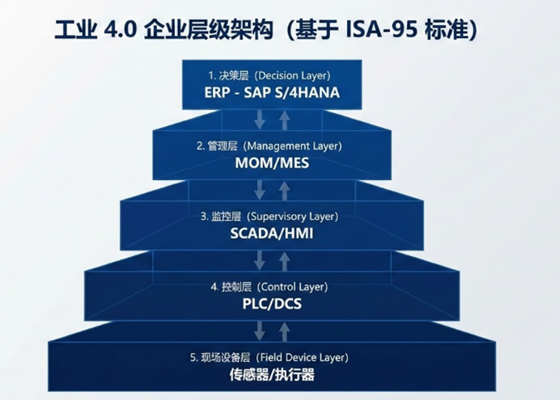

[cite_start]**撰写人：** 肖祥辉 [cite: 2]
[cite_start]**撰写日期：** 2026年4月15日 [cite: 3]

## 前言
[cite_start]本手册旨在定义企业从决策到执行的层级边界，并展示三大系统（ERP-MES-WMS）间的数据流转与业务协同，为工业软件实施提供标准化参考 [cite: 1, 4]。

---

## 第一部分：纵向集成架构（金字塔模型）

[cite_start]核心逻辑遵循 **ISA-95 国际标准**，明确了企业各层级的职责划分 [cite: 5]。

[cite_start]*图1：基于 ISA-95 标准的企业垂直集成模型 [cite: 6]*

### 1. 核心集成逻辑
* [cite_start]**数据源头管理**：ERP 负责维护全局主数据（Master Data），确保编码与 BOM 的唯一性，消除数据孤岛 [cite: 7]。
* [cite_start]**通信协议标准**：L3 与 L4 层级间主要采用 OPC UA 或 MQTT 协议，实现跨平台设备实时通讯 [cite: 8]。
* [cite_start]**双向反馈机制**：支持指令下行与现场数据实时回传，实现生产全流程闭环 [cite: 9]。

### 2. 层级边界定义 [cite: 10]
* [cite_start]**ERP vs MES**：边界在于“工单”。ERP 决定“做什么”，MES 决定“怎么做” [cite: 11, 12]。
* [cite_start]**MES vs SCADA**：边界在于“时间粒度”。MES 关注班组进度（分钟/小时），SCADA 关注实时数值（秒/毫秒） [cite: 13, 14]。
* [cite_start]**SCADA vs PLC**：边界在于“控制权”。PLC 是执行大脑，SCADA 是监控部 [cite: 15, 16]。

---

## 第二部分：横向业务闭环（ERP-MES-WMS 协同）

[cite_start]以生产订单为核心，展示系统间的业务协同与数据流 [cite: 17, 18]。

[cite_start]*图2：SAP(ERP)、MES、WMS 双向数据流转图 [cite: 18]*

### 1. 核心业务流转路径 [cite: 19]
1.  [cite_start]**订单下发 (ERP → MES)**：下发生产工单（PO），确定交期 [cite: 20, 25, 27]。
2.  [cite_start]**领料请求 (MES → WMS)**：触发领料申请，实现精准供料 [cite: 21, 28, 30]。
3.  [cite_start]**库存反馈 (WMS → SAP/MES)**：反馈出库状态，更新财务账套与线边水位 [cite: 22, 31, 32]。
4.  [cite_start]**报工反馈 (MES → ERP)**：提交完工数据，触发 ERP 自动结算成本 [cite: 23, 34, 36]。

### 2. 实施重点：三大对账矛盾解析 [cite: 37, 61]
在实际实施中，系统集成往往面临以下底层矛盾：
* [cite_start]**工单对账（颗粒度矛盾）**：ERP 的商务大单与 MES 的排产小单需建立 Parent_ID 与 Child_ID 的映射，解决拆单后的追溯问题 [cite: 38, 44, 71]。
* [cite_start]**物料对账（权属矛盾）**：明确“线边仓”物料的所有权归属，建立“移库确认”机制防止账实不符 [cite: 39, 50, 52]。
* [cite_start]**产成品对账（时效性矛盾）**：解决报工延迟导致的财务成本结算偏差，优化“倒冲”逻辑 [cite: 40, 56, 58]。

---

## 第三部分：前沿技术架构（IIoT 与云端数字化）

[cite_start]展示 5G、边缘计算等新技术如何重构传统工业 IT 架构 [cite: 96, 97]。

[cite_start]*图3：未来智能工厂数字化架构演进 [cite: 97]*

### 1. 技术架构演进点 [cite: 98]
* [cite_start]**边缘计算 (Edge Computing)**：在侧端处理数据，解决实时控制的延迟 [cite: 100, 113]。
* [cite_start]**IIoT 网关**：统一数据接口，彻底消解数据孤岛 [cite: 101, 116]。
* [cite_start]**数字孪生 (Digital Twin)**：建立物理工厂的实时映射，实现预测性维护 [cite: 102, 120]。

### 2. 未来趋势 [cite: 103]
[cite_start]未来工业架构将从“链式”转向“数据湖”，数据实时汇聚到统一底座，实现 IT 与 OT 的深度融合 [cite: 104, 118][cite_start]。系统将从“被动处理”转向通过 AI 模型“预测干预” [cite: 105, 121]。

---

## 结语：实施顾问的“三板斧” [cite: 91]
1.  [cite_start]**唯一源头**：确保工单头在 ERP，工艺路径在 MES，库存余量在 WMS [cite: 93]。
2.  [cite_start]**异步处理**：建立完善的重发机制与异常日志 [cite: 94]。
3.  [cite_start]**容差管理**：系统需自动识别并上报合理损耗 [cite: 95]。